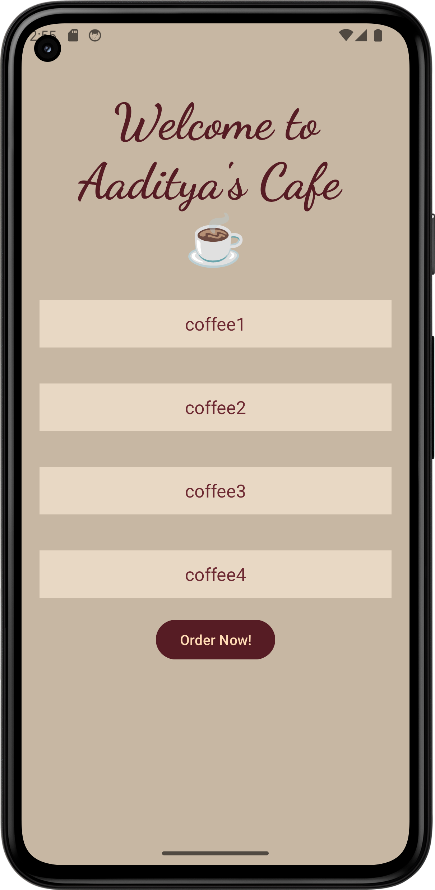

# Kotlin Multi-Screen App (Basic)

This project is a basic Android application developed in Kotlin, demonstrating how to pass data between two screens (activities) using `Intent`. The user can input up to four orders on the main screen and then navigate to a second screen where the orders are displayed.

## Features

- Multi-screen navigation
- Data passing between activities using `Intent`
- User input through `EditText` fields
- Displaying data on a new screen

## Screenshots

- **Main Screen**: Where the user inputs their orders.
- **Order Screen**: Displays the list of orders passed from the main screen.

## Project Structure

This project has two main activities:

1. **MainActivity**: Allows the user to enter four orders and navigate to the `Show_Order` activity to display them.
2. **Show_Order**: Displays the orders entered on the first screen.

## How It Works

- The user inputs their orders in four `EditText` fields.
- Upon clicking the "Order Now!" button, the inputted data is bundled into a string and passed to the `Show_Order` activity via an `Intent`.
- The `Show_Order` activity retrieves this data and displays it in a `TextView`.

## Key Concepts

### 1. **Intent for Data Passing**

An `Intent` is used to navigate from one screen to another and pass data between them. In this case, we're passing the user's orders from `MainActivity` to `Show_Order`.

#### Code Snippet - Data Passing via Intent

```kotlin
// Inside MainActivity
val ordersList = "I ordered\n1. " + editT1.text.toString() + "\n2. " + editT2.text.toString() + "\n3. " + editT3.text.toString() + "\n4. " + editT4.text.toString()

// Creating intent to navigate to Show_Order activity
intent = Intent(this, Show_Order::class.java)

// Adding the orders list as extra data
intent.putExtra(KEY, ordersList)

// Starting the new activity
startActivity(intent)
```

### 2. **Retrieving Data in the Second Activity**

The second activity retrieves the data using the same key passed in the `Intent`.

#### Code Snippet - Retrieving Data in Show_Order

```kotlin
// Inside Show_Order activity
val takeOrders = intent.getStringExtra(MainActivity.KEY)

// Displaying the passed data in a TextView
val tV = findViewById<TextView>(R.id.textView)
tV.text = takeOrders
```

## Setup and Installation

### Prerequisites

- Android Studio
- Kotlin support enabled in Android Studio

### Steps to Run the App

1. Clone this repository or download the project zip.
2. Open the project in Android Studio.
3. Build the project to install all dependencies.
4. Run the app on an emulator or an Android device.

## XML Layout Overview

### MainActivity Layout (`activity_main.xml`)

This layout contains:

- A `TextView` to display the app's title.
- Four `EditText` fields for the user to input their orders.
- A `Button` to trigger the data passing and navigation to the next screen.

### Show_Order Layout (`activity_show_order.xml`)

This layout contains:

- A `TextView` to display the orders passed from the `MainActivity`.

## Screenshots

| Main Screen | Order Screen |
|-------------|--------------|
|  |  |


## Dependencies

- Kotlin
- Android SDK

## License

This project is open-source and available under the [MIT License](LICENSE).
